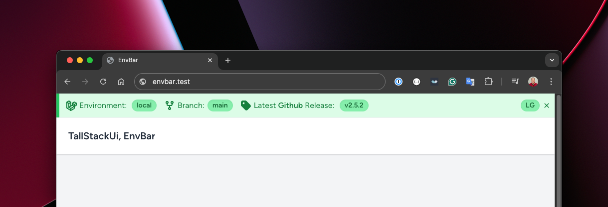

# TallStackUi, EnvBar

    
    
    

> This package is part of the TallStackUi.

## Introduction

**EnvBar** is a powerful environment bar injected at the top of the page, displaying useful information from the current environment.

## Documentation

[Visit the TallStackUi website to see the documentation](https://tallstackui.com/docs)

## Sponsorship

If you want to support the development of TallStackUI, you can do so by [becoming a sponsor](https://github.com/sponsors/devajmeireles).

## Need Help?

🐞 If you spot a bug, please [submit a detailed issue.](https://github.com/tallstackui/envbar/issues/new/choose)

💬 If you love chatting, [we have a Discord server dedicated to the TallStackUI community.](https://discord.gg/sfr66WXh4A)

## Contributing

Thank you for wanting to be part of our team! 👋 [Click here to learn more.](https://tallstackui.com/docs/contribution)
